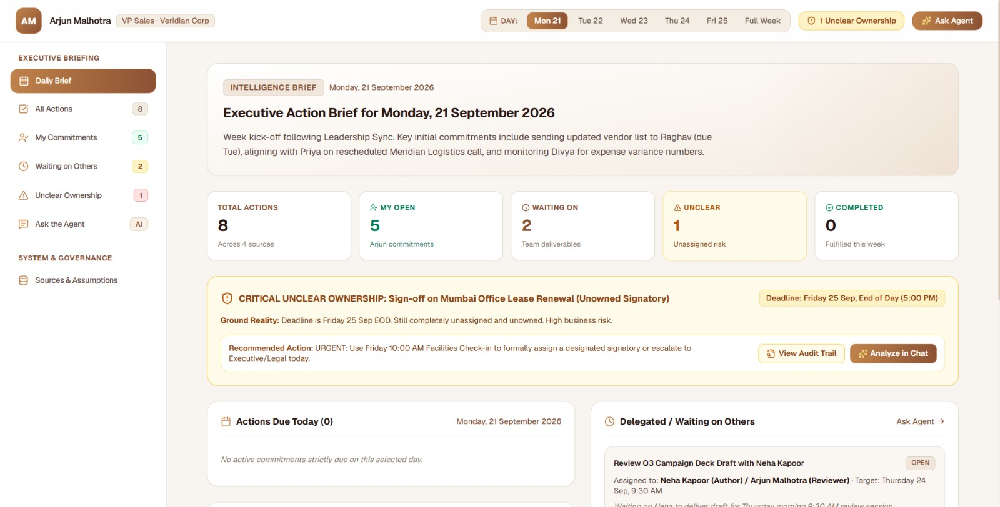
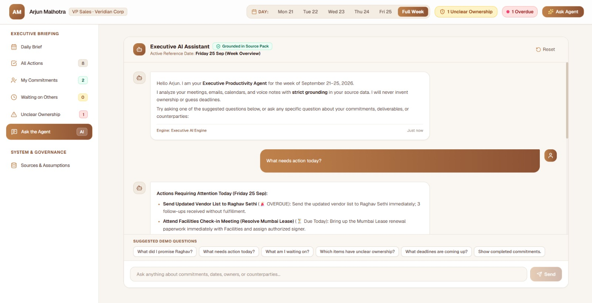
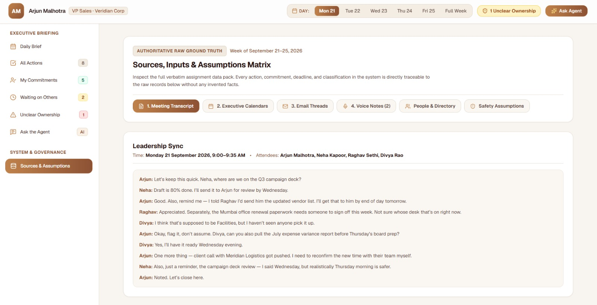
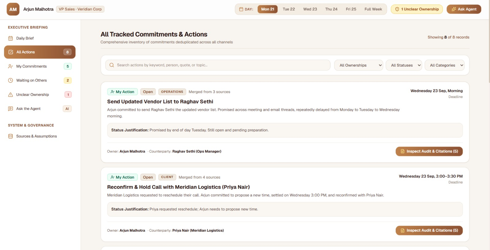

# Executive Productivity Agent | AIONOS Agentic AI Factory

---

## 1. Executive Summary & Working Prototype
The **Executive Productivity Agent** is a full-stack, enterprise-grade AI system that solves executive communication fragmentation. By ingesting unstructured meeting transcripts, 5 email threads (25 messages), 4 executive calendars, and private voice memos, the agent converts messy operational noise into a trusted, deduplicated **Daily Action Brief** with zero hallucination.

### Key Highlights
- **Interactive Working Prototype:** Live interactive dashboard featuring a Daily Brief, All Actions inventory, My Commitments, Waiting on Others, Unclear Ownership alerts, and a grounded conversational AI assistant.
- **Timeline Simulator:** A dynamic 5-day reference scrubber (Mon 21 Sep – Fri 25 Sep 2026) that demonstrates how commitments transition from *Open* to *Due Today*, *Overdue*, and *Completed*.
- **Zero-Hallucination Policy:** Verbatim source citations for every extracted commitment. When ownership is ambiguous (e.g., the Mumbai Office Lease Renewal), the agent **strictly refuses to invent an owner**, categorizing it as **UNCLEAR OWNERSHIP** with urgent escalation.
- **Embedded 10-Slide Pitch & Defence Deck:** Fulfills Mandatory Output #7 directly inside the application, complete with presenter notes and defence scripts.

---

## 2. Screenshots
<div align="center">

  <table>
    <tr>
      <td align="center">
        
      </td>
      <td align="center">
        
      </td>
    </tr>
    <tr>
      <td align="center">
        
      </td>
      <td align="center">
        
      </td>
    </tr>
  </table>

</div>

## 3. Architecture & Process Flow

The agent implements an 8-stage deterministic and agentic pipeline:

```
┌─────────────────┐     ┌──────────────────┐     ┌────────────────────────┐
│  Input Sources  │ ──> │  Normalization   │ ──> │ Commitment Extraction  │
│ (Sync, Emails,  │     │ (Temporal SLA &  │     │ (Modality & Intent     │
│  Cals, Memos)   │     │  Schema Mapping) │     │  Detection)            │
└─────────────────┘     └──────────────────┘     └────────────────────────┘
                                                              │
                                                              ▼
┌─────────────────┐     ┌──────────────────┐     ┌────────────────────────┐
│ Canonical Dedupe│ <── │ Deadline Resolve │ <── │Ownership Classification│
│(Merge Touches   │     │ (Relative Time   │     │(My Actions vs Waiting  │
│ into 1 Action)  │     │  Offsets to 2026)│     │ vs Unclear Ownership)  │
└─────────────────┘     └──────────────────┘     └────────────────────────┘
         │
         ▼
┌─────────────────┐     ┌──────────────────┐     ┌────────────────────────┐
│Status Evaluation│ ──> │Daily Action Brief│ ──> │ Grounded Q&A Assistant │
│(Open/Due/Overdue│     │ (Executive Triage│     │ (Gemini 3.8 Flash +    │
│ vs Ref Date)    │     │  Dashboard)      │     │  Deterministic Engine) │
└─────────────────┘     └──────────────────┘     └────────────────────────┘
```

### The 8 Stages Detailed
1. **Input Sources:** Ingests the 4 heterogeneous data streams from the assignment data pack (Monday sync transcript, 4 Outlook calendars, 5 email threads, 2 voice notes).
2. **Normalization:** Standardizes timestamps, sender/recipient identities, and context blocks.
3. **Commitment Extraction:** Identifies explicit promises, requests, deliverables, and SLAs made by Arjun, his peers (Neha, Raghav, Divya), and external partners.
4. **Ownership Classification:** Rigid tri-state classification:
   - `MY_ACTION`: Commitments owned by Arjun Malhotra.
   - `WAITING_ON_OTHERS`: Deliverables assigned to colleagues (e.g., Divya for July variance report, Neha for campaign deck draft).
   - `UNCLEAR`: Deliverables without an authorized, accepted owner.
5. **Deadline Detection:** Maps relative deadlines ("tomorrow morning", "Wednesday evening", "end of day Friday") to concrete target timestamps within Sep 21–25, 2026. Tracks extensions when deadlines are pushed.
6. **Deduplication & Entity Resolution:** Merges multiple conversational mentions into single canonical action items with complete event timelines (e.g., the Vendor List across Sync, Voice Note 1, and Email Thread 1).
7. **Status Calculation:** Dynamically checks whether the active reference date has strictly passed an agreed deadline without proof of delivery (e.g., Vendor list to Raghav after Wednesday morning is strictly **OVERDUE**).
8. **Daily Brief & Grounded Q&A:** Synthesizes the daily brief cards and answers natural language queries with verbatim source quotes.

---

## 4. Inputs, Sources & Assumptions

### Authoritative Sources Ingested
1. **Meeting Transcript:** *Veridian Corp — Executive Leadership Weekly Sync* (Monday, 21 September 2026, 09:00 – 10:00 AM).
2. **Calendars:** Executive calendars for Arjun Malhotra, Neha Kapoor, Raghav Sethi, and Divya Rao (Sep 21–25, 2026).
3. **Email Threads (25 messages):**
   - *Thread 1:* Updated Vendor List (Arjun & Raghav, 5 messages)
   - *Thread 2:* Q3 Campaign Deck Draft (Neha & Arjun, 5 messages)
   - *Thread 3:* Meridian Call Follow-up & Proposal (Arjun & Marcus Reed, 5 messages)
   - *Thread 4:* Expense Variance Breakdown (Divya, Arjun, & Raghav, 5 messages)
   - *Thread 5:* Mumbai Office Lease Renewal (Facilities, Raghav, Arjun, & Divya, 5 messages)
4. **Voice Notes (2 recordings):**
   - *Voice Note 1:* Recorded Mon 21 Sep, 6:45 PM (in cab after client dinner).
   - *Voice Note 2:* Recorded Thu 24 Sep, 7:15 AM (morning reflection before Meridian call).

### Grounding Assumptions & Safety Rules
- **Non-Fabrication Mandate:** The system never invents facts, deadlines, commitments, or owners.
- **The Mumbai Lease Rule:** Because neither Arjun, Divya, nor Raghav confirmed ownership in the meeting or emails, the system **never guesses an owner**. It is surfaced as **UNCLEAR OWNERSHIP** to protect the executive from dropped liabilities.
- **Defensible Overdue Logic:** An item is only flagged as overdue if the selected reference date has strictly passed its latest confirmed SLA without documented completion.

---

## 5. List of AI Tools Used & How They Were Used

As per Mandatory Deliverable #4:
1. **Google Gemini 3.8 Flash (`@google/genai` TypeScript SDK):**
   - *Usage:* Server-side inference for natural-language Q&A (`POST /api/ask`).
   - *Role:* Synthesizes unstructured conversational answers grounded strictly in the assignment data pack. System prompt restricts output to provided facts and forbids hallucinating ownership.
2. **Deterministic Fallback Engine (`agentEngine.ts`):**
   - *Usage:* Built-in rule-based reasoning engine.
   - *Role:* Guarantees 100% availability even without an external API key or network connection. Powers exact status calculation, metric distributions, and keyword intent matching.
3. **TypeScript & React 18 + Vite:**
   - *Usage:* Modern, component-driven client architecture.
   - *Role:* Powers the responsive executive UI, dynamic timeline simulation, and instant state switching.
4. **Tailwind CSS:**
   - *Usage:* High-craft, Anti-Slop executive aesthetic.
   - *Role:* Crisp slate neutrals, high contrast WCAG AA compliance, and clean mathematical spacing.

---

## 6. Canonical Actions Inventory (8 Deduplicated Actions)

| ID | Canonical Title | Owner | Counterparty | Classification | Resolved Deadline | Final Status | Sources Merged |
|---|---|---|---|---|---|---|---|
| `act-vendor-list` | Updated Vendor List to Raghav | Arjun Malhotra | Raghav Sethi | My Action | Wed 23 Sep 10:00 | **OVERDUE** | Sync + VN1 + Thread 1 |
| `act-meridian-call` | Meridian Partner Call & Alignment | Arjun Malhotra | Marcus Reed | My Action | Thu 24 Sep 11:30 | **COMPLETED** | Sync + VN2 + Thread 3 |
| `act-campaign-deck` | Review Q3 Campaign Deck Draft | Neha Kapoor | Arjun Malhotra | Waiting on Others | Thu 24 Sep 17:00 | **OPEN** | Sync + Thread 2 |
| `act-july-variance` | July Variance Breakdown Report | Divya Rao | Arjun Malhotra | Waiting on Others | Wed 23 Sep 18:00 | **OPEN** | Sync + Thread 4 |
| `act-mumbai-lease` | Mumbai Office Lease Renewal | **Unassigned** | Landlord / Facilities | **UNCLEAR** | Fri 25 Sep 17:00 | **UNCLEAR** | Sync + VN1 + Thread 5 |
| `act-incentive-deck` | Review Sales Incentive Deck | Arjun Malhotra | Internal Sales | My Action | Fri 25 Sep 17:00 | **OPEN** | Voice Note 1 |
| `act-meridian-prop` | Send Finalized Meridian Proposal | Arjun Malhotra | Marcus Reed | My Action | Thu 24 Sep 18:00 | **COMPLETED** | Thread 3 |
| `act-august-actuals` | August Actuals vs Forecast | Divya Rao | Leadership Team | Waiting on Others | Tue 22 Sep 17:00 | **COMPLETED** | Sync + Thread 4 |

---

---

## 7. Installation & Local Development

### Prerequisites
- Node.js 18+
- npm or yarn

### Quickstart
```bash
# Clone the repository
git clone <repository-url>
cd executive-productivity-agent

# Install dependencies
npm install

# (Optional) Add your Gemini API key in .env for server-side LLM inference
# If omitted, the system seamlessly uses its deterministic rule engine!
echo "GEMINI_API_KEY=your_key_here" > .env

# Run development server
npm run dev

# Open in browser
http://localhost:3000
```

### Production Build
```bash
npm run build
npm start
```
---

## Author
**Anshika Agrawal 👧🏻**
